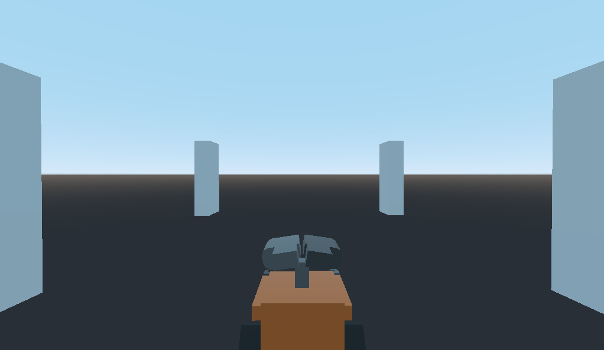

# Godot Third Person Controller Example (Simplest Version)

The purpose of this repo is to demo the absolutely minimal and simplest code necessary to implement a 3D, Third-Person game with full camera control. The intended audience is a game developer who is familiar with Godot, but new to 3D.

Note that there is a "**Simplest Version**" on the [`main`](https://github.com/HaywardMorihara/simplest-third-person-controller-example)/[`Simplest`](https://github.com/HaywardMorihara/simplest-third-person-controller-example/tree/Simplest) branches and a "**Template Version**" on the [`Template`](https://github.com/HaywardMorihara/simplest-third-person-controller-example/tree/Template) branch. These versions slightly different and serve different purposes:

## Simplest
The **Simplest Version** is intended for *learning the necessary code to implement a 3D game*. It has flaws and gaps and therefore should be considered far from ready to serve as the base for a game.

*COMING SOON - Godot Asset Library Link*

*COMING SOON - Documentation explaining the **Simplest Version***

## Template
*IN DEVELOPMENT*

The **Template Version** is intended to serve as the *base for a 3D game with full third-person camera controls*. The code is slightly more complex than the Simplest Version to include more features desirable for an actual game (e.g. smoothing of turns) and therefore isn't as well-suited for beginner learning.

You can see a browser-based example of the Template Version [here](https://murphysdad.itch.io/godot-third-person-controller-template).